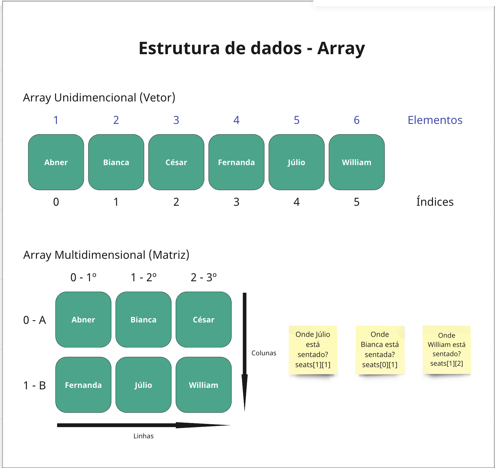

# Array - Estrutura de dados

## Definição

> Um array (arranjo ou vetor) é um conjunto de dados (que pode assumir os mais diversos tipos, desde do tipo primitivo, a objeto dependendo da linguagem de programação). Arrays são utilizados para armazenar mais de um valor em uma única variável. Isso é comparável a uma variável que pode armazenar apenas um valor. Cada item do array tem um número ligado a ele, chamado de índice numérico, que permite acesso a cada "valor" armazenado na variável.   - [MDN Glossary](https://developer.mozilla.org/pt-BR/docs/Glossary/Array)

## Exemplo

## Para lembrar

- O array é a estrutura de dados mais simples e mais utilizada
- Todas as linguagens de programação têm
- Cada elemento recebe um valor numérico positivo (índice) que corresponde à posição do item dentro do array
- Pode ser derivada para outras estruturas de dados (tais como pilhas e filas)
- Pode ser unidimensional ou multidimensional

## Operações Básicas

- Insert (inserir) — Insere um elemento em um determinado índice
- Get (receber) — Retorna um elemento em um determinado índice
- Delete (excluir) — Remove um elemento em um determinado índice
- Size (tamanho) — Obtém o número total de elementos de um array

## Fontes

[MDN Glossary](https://developer.mozilla.org/pt-BR/docs/Glossary/Array)

[As principais estruturas de dados que você deve conhecer para sua próxima entrevista](https://www.freecodecamp.org/portuguese/news/as-principais-estruturas-de-dados-que-voce-deve-conhecer-para-sua-proxima-entrevista-de-programacao/)
