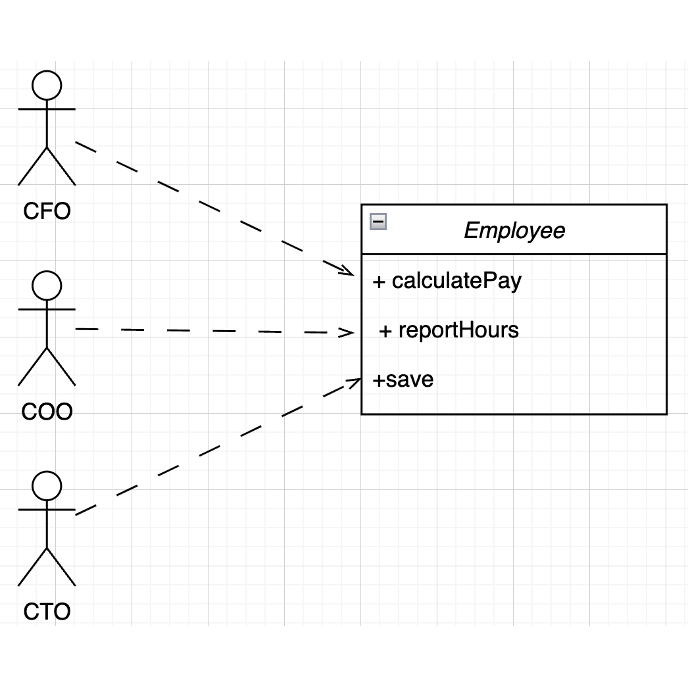

# Simple Responsibility Principle

### Definição

Original: ~~Um módulo deve ter uma, e apenas uma, razão para mudar~~

_Um módulo deve ser responsável por um, e apenas um, ator_

Sendo o módulo um conjunto coeso de funções e estrutura de dados. A palavra coesão é a força que amarra o código responsável a um único ator

### Sintomas

#### Duplicação Acidental



Esta classe viola o SRP porque esse três métodos são responsáveis por três atores bem diferentes.

- O método calculatePay() é especificado pelo departamento de contabilidade., subordinado ao CFO
- O método reportHours() é especificado e usado pelo departamento de recursos humanos, subordinado ao COO
- O método save() é especificado pelo administrador de banco de dados (DBA), subordinado ao CTO.

Ao incluir o código-fonte desses três métodos em uma única class Employee, os desenvolvedores acoplaram cada um desses atores aos outros. Este acoplamento pode fazer com que as ações doa equipe do CFO prejudiquem algo de que a equipe do COO dependa.

### Conclusão

O Princípio da Responsabilidade única trata de funções e classes — mas reaparece de forma diferente em outros dois níveis.

1. No nível dos componentes, ele se torna o Princípios de Fechamento Comum (Common Closure Principle).
2. No nível arquitetural, é o eixo da mudança (Axios of Change) responsável pela criação de Limites Arquiteturais.

Fonte: Livro Arquitetura Limpa (Robert C. Martin)

---

### Exemplo:

- Uma máquina de lavar com peças de "cadastro" (vermelhas) e "login" (claras)
  - Faça duas máquinas completamente separadas!

Dica

- Tentar colocar no nome da função ou do componente tudo que ele faz
  - Não faça
    ```swift
       func registrationAndEmailConfirmationAndAuthentication() {...}
    ```
    - Este método tem muitas responsabilidades

---

### FlashCards

```json
[
  {
    "front": "Quando uma classe pode ser considerada coesa?",
    "back": "Quando utiliza os seus atributos em seus métodos."
  }
]

``
```
